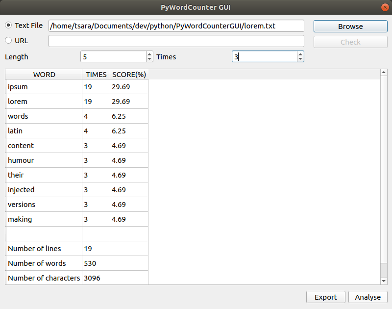
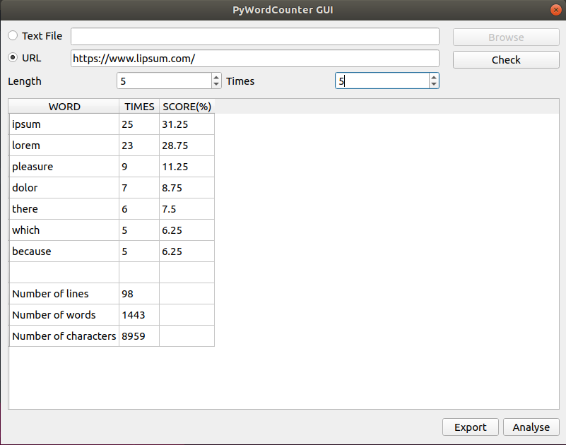
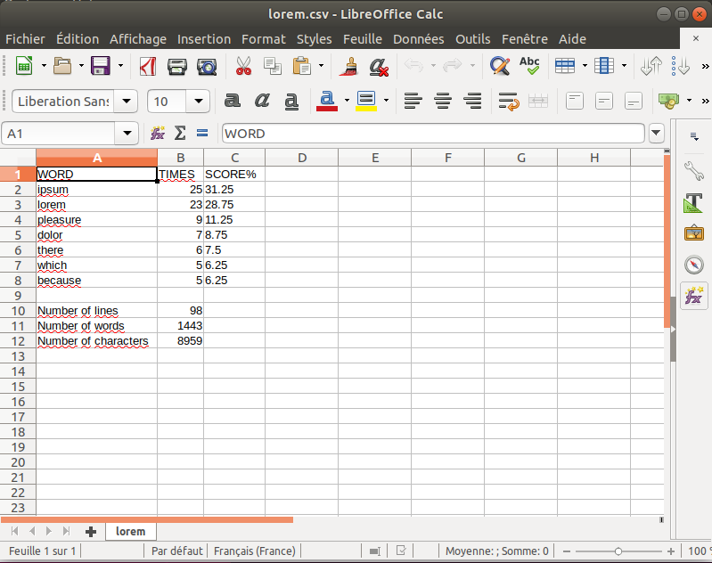

PyWordCounter
=========

Python GUI app to display the number of lines, words and characters for a text file or a website. Then a table about number of each word is displayed and can be saved into a csv file.
Please check [PyWordCounter](https://github.com/arasT/PyWordCounter) if you want to use console script instead of GUI interface.

Screenshots
---




How to use
---

This app is developped in [Python2.7](https://www.python.orAg/download/releases/2.7/).
It uses [Pyside2-5.11](http://download.qt.io/snapshots/ci/pyside/5.11/latest/pyside2/) to create GUI.
([Pyside2 installation guide](https://wiki.qt.io/Qt_for_Python/GettingStarted))

Clone or Download this repository.
```
git clone https://github.com/arasT/PyWordCounterGUI
```
Extract the archive and move into it.
```
cd PyWordCounter
```

Run
---
Run the main script.
```
python PyWordCounterGUI.py
```

GUI instructions
---
* **Text File** : radio button to specify if we would like to analyse a text file instead of a website. File path will be set into the input text near this radio button.
* **Browse** : button to take a file to analyse.
* **URL** : radio button to specify if we would like to analyse a website instead of a text file. URL will be set into the input text near this radio button.
* **Check** : button to check if the website can be analysed.
* **Analyse** : button start analysis and display result into the middle of the window as a table.
* **Export** : export the results into a csv file.
* **Length** : filter the result by showing only word having a length greater or equal to the specified length.
* **Times** : filter the result by showing only word that repeat equal or more than the specified number.

License
----

The MIT License.
Further details see LICENSE file.


Contributing
----

Please fork if you want to contribut to this project.
